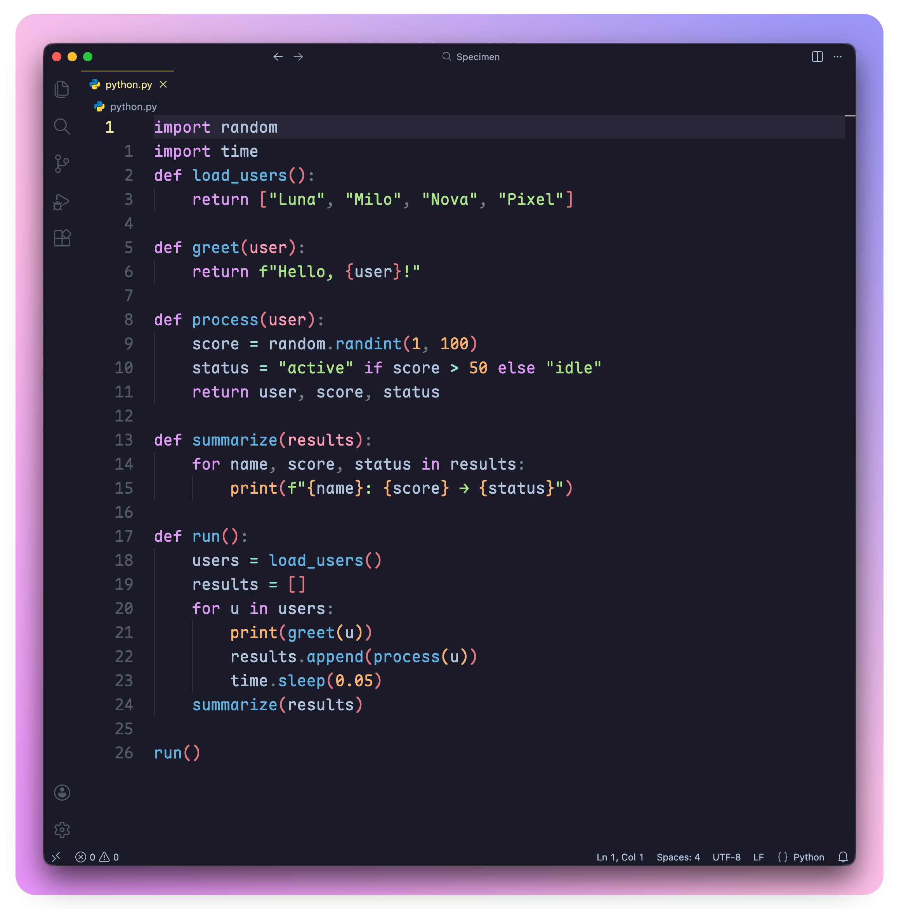
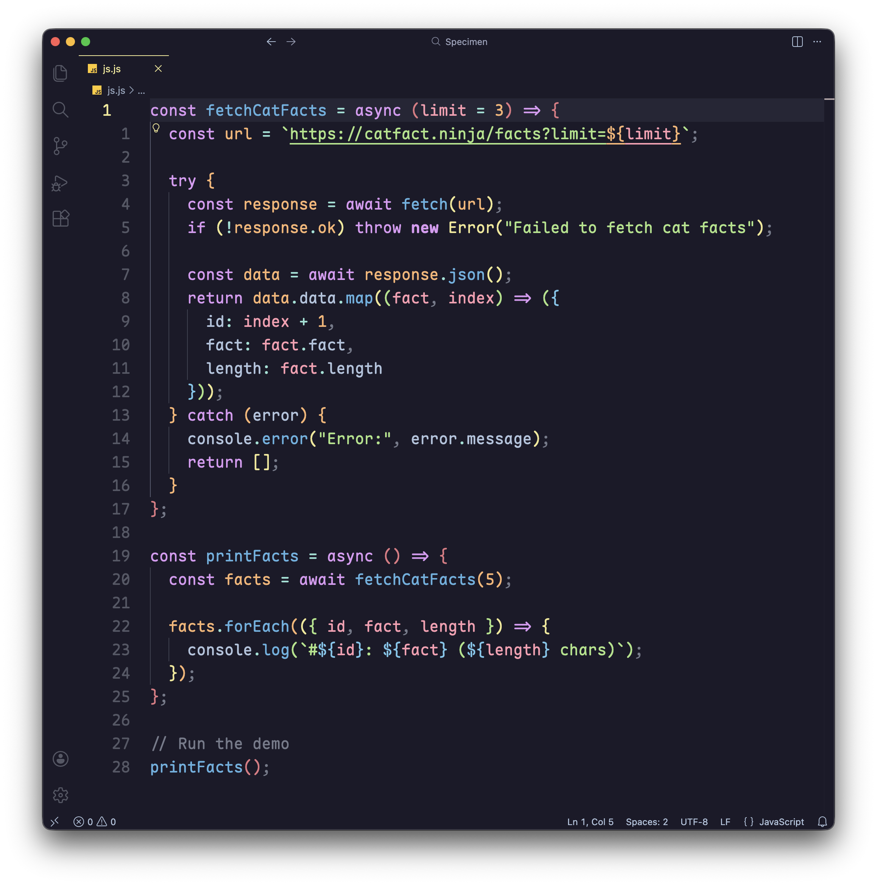
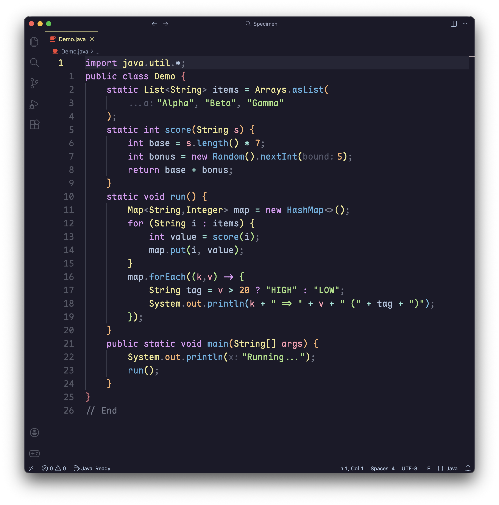
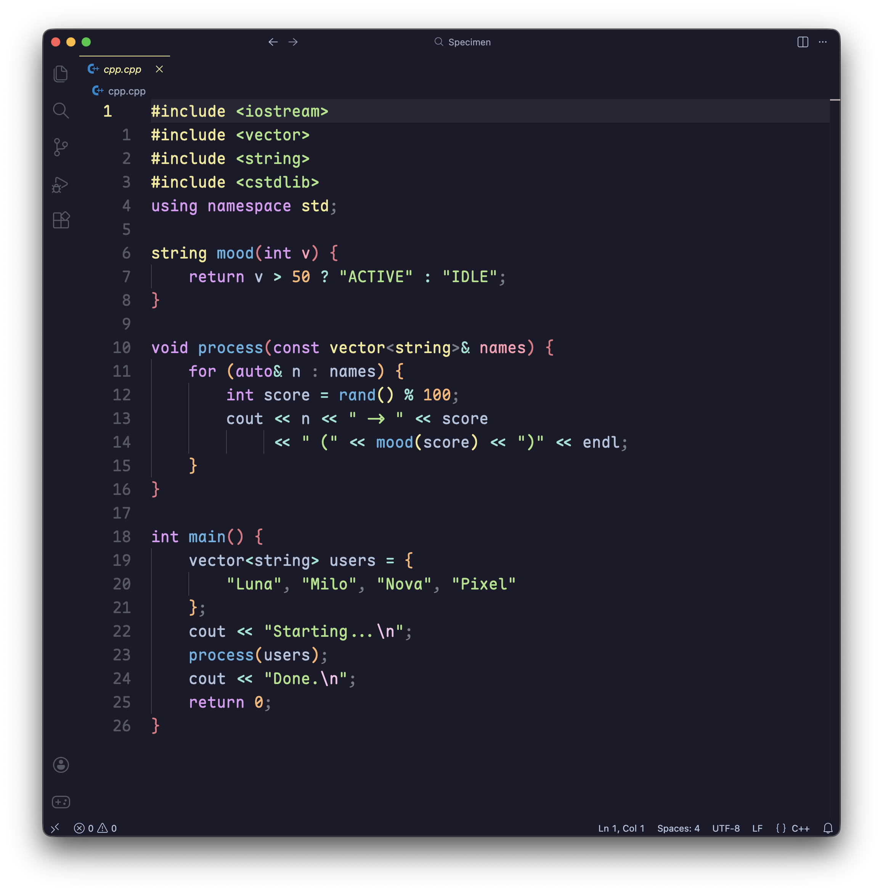
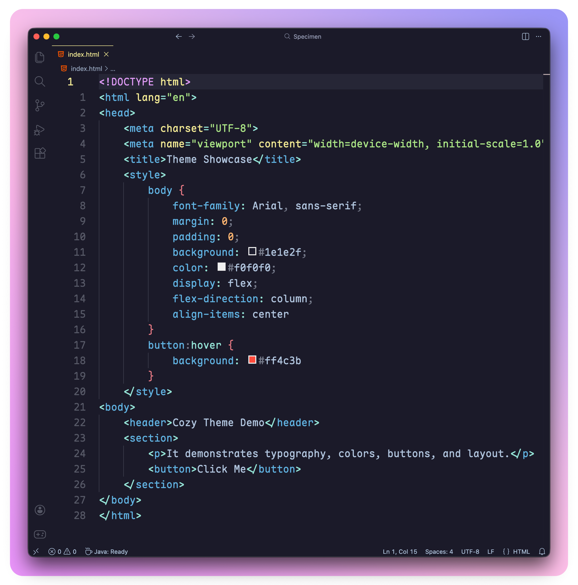
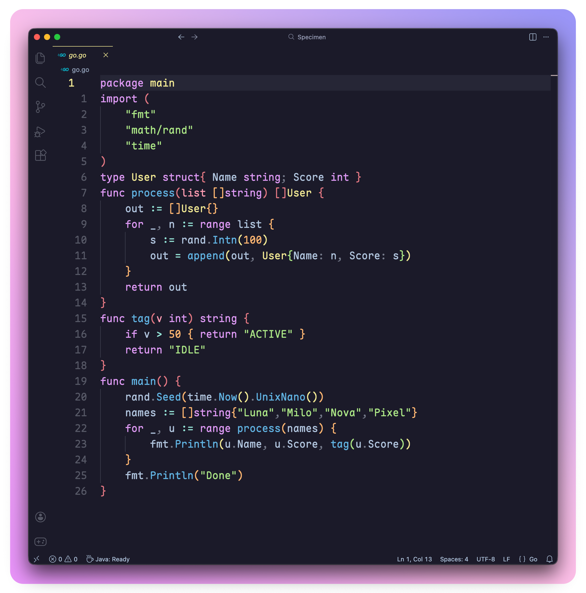
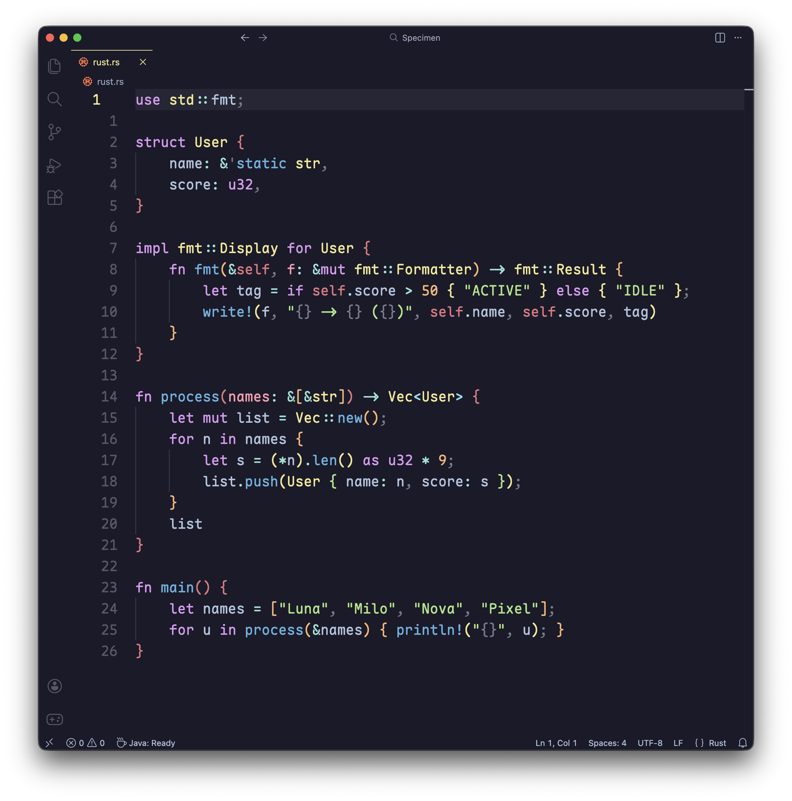
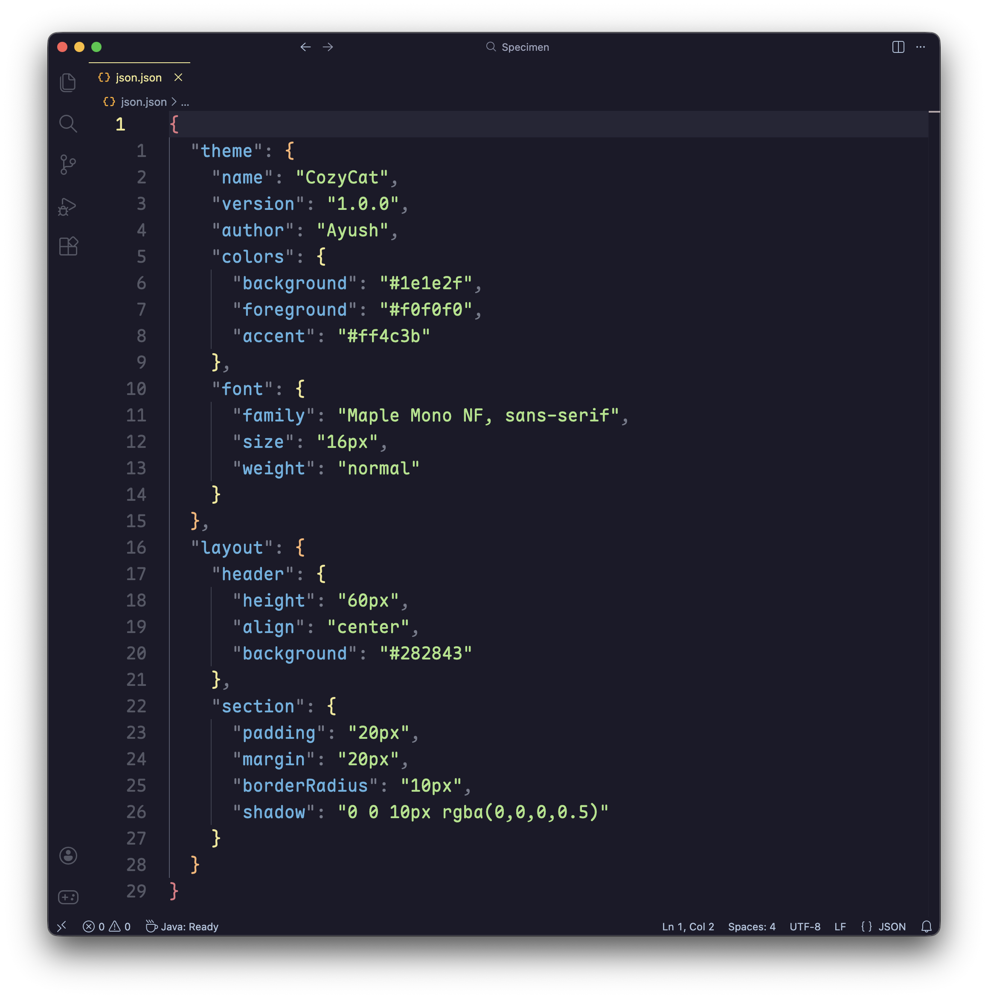

<div align="center">

  <!-- Icon -->
  

  <!-- Title -->
  <h1 style="font-size:20px; color:#b0c4dd; margin:12px 0 20px 0;">
    CozyCat for <a href="https://code.visualstudio.com">VSCode</a>
  </h1>

  <!-- Badges -->
  <div style="display:flex; gap:6px; justify-content:center; flex-wrap:wrap; margin-bottom:16px;">
    
    
    
  </div>

</div>

---

<p align="center"> CozyCat is a <b>warm, calm, and elegant dark theme 🌙</b> for Visual Studio Code, designed to make coding comfortable and enjoyable for long sessions.  
With soft colors and subtle contrasts, CozyCat reduces eye strain 👀 while keeping your code readable and beautiful 🎨.
</p>


---
## Features ✨

- 🌑 Dark, soothing color palette  
- 🎯 Carefully selected syntax highlighting for better readability  
- 🧘 Minimalistic UI elements for a distraction-free experience  
- 🖥️ Eye-friendly design for long working hours  

---

<h2>Palette 🎨</h2>
<div align="center" style="display:flex; flex-wrap:wrap; justify-content:center; gap:4px;">
  <span style="background:#f5e0dc;color:#000;padding:4px 8px;border-radius:6px;">#f5e0dc</span>
  <span style="background:#f2cdcd;color:#000;padding:4px 8px;border-radius:6px;">#f2cdcd</span>
  <span style="background:#f5c2e7;color:#000;padding:4px 8px;border-radius:6px;">#f5c2e7</span>
  <span style="background:#dd99f4;color:#000;padding:4px 8px;border-radius:6px;">#dd99f4</span>
  <span style="background:#e27882;color:#000;padding:4px 8px;border-radius:6px;">#e27882</span>
  <span style="background:#fd9db2;color:#000;padding:4px 8px;border-radius:6px;">#fd9db2</span>
  <span style="background:#fbb470;color:#000;padding:4px 8px;border-radius:6px;">#fbb470</span>
  <span style="background:#f0e893;color:#000;padding:4px 8px;border-radius:6px;">#f0e893</span>
  <span style="background:#aae484;color:#000;padding:4px 8px;border-radius:6px;">#aae484</span>
  <span style="background:#94e2d5;color:#000;padding:4px 8px;border-radius:6px;">#94e2d5</span>
  <span style="background:#89dceb;color:#000;padding:4px 8px;border-radius:6px;">#89dceb</span>
  <span style="background:#74c7ec;color:#000;padding:4px 8px;border-radius:6px;">#74c7ec</span>
  <span style="background:#60b2e1;color:#000;padding:4px 8px;border-radius:6px;">#60b2e1</span>
  <span style="background:#b4befe;color:#000;padding:4px 8px;border-radius:6px;">#b4befe</span>
  <span style="background:#b0c4dd;color:#000;padding:4px 8px;border-radius:6px;">#b0c4dd</span>
  <span style="background:#9ca2bb;color:#000;padding:4px 8px;border-radius:6px;">#9ca2bb</span>
  <span style="background:#9399b0;color:#000;padding:4px 8px;border-radius:6px;">#9399b0</span>
  <span style="background:#767b8b;color:#fff;padding:4px 8px;border-radius:6px;">#767b8b</span>
  <span style="background:#565866;color:#fff;padding:4px 8px;border-radius:6px;">#565866</span>
  <span style="background:#54586c;color:#fff;padding:4px 8px;border-radius:6px;">#54586c</span>
  <span style="background:#3e404f;color:#fff;padding:4px 8px;border-radius:6px;">#3e404f</span>
  <span style="background:#2b2c3b;color:#fff;padding:4px 8px;border-radius:6px;">#2b2c3b</span>
  <span style="background:#1B1A29;color:#fff;padding:4px 8px;border-radius:6px;">#1B1A29</span>
</div>


---

## Preview 👀
<p align="center">

  

</p>

### Language-wise Examples 💻

<details>
<summary>Python 🐍</summary>

</details>

<details>
<summary>JavaScript ⚡</summary>

</details>

<details>
<summary>Java ☕</summary>

</details>

<details>
<summary>C++ 💻</summary>

</details>

<details>
<summary>HTML 🌐</summary>

</details>

<details>
<summary>CSS 🎨</summary>

</details>

<details>
<summary>Go 🐹</summary>

</details>

<details>
<summary>Rust 🦀</summary>

</details>

<details>
<summary>JSON 📄</summary>

</details>

---

## Installation 🚀

### From Marketplace  
Bring some coziness to your VS Code! 🌙
Install [CozyCat Theme](https://marketplace.visualstudio.com/items?itemName=cozy-cat.cozycat) from the Marketplace
or search “CozyCat Theme” in your Extensions panel.

### From VSIX  
1. Open **Command Palette → Extensions: Install from VSIX...**  
2. Select your `.vsix` file  
3. Go to **Preferences → Color Theme → choose CozyCat**

---

## Usage 🎛️

To activate the theme:  
**Command Palette → Preferences: Color Theme → CozyCat**

Enjoy a clean, calm, cozy coding environment 😺.

---

## Customization 🎨

You can style different parts of your code—like comments, keywords, or function names—using **italic**, **bold**, **both**, or leave them normal.  
If you don’t want any style, just use `""`.

### How it works ⚙️

- **scope** → Defines which part of your code the style applies to  
  - Examples: `"comment"`, `"keyword"`, `"entity.name.function"`  
- **fontStyle** → Defines the style applied to that scope  
  - `"italic"` → makes text italic  
  - `"bold"` → makes text bold  
  - `"italic bold"` → both italic and bold  
  - `""` → normal (no style)  

You can combine multiple scopes in a single block.

### Example 📝

```jsonc
"editor.tokenColorCustomizations": {
    "textMateRules": [
        {
            "scope": "comment",           
            "settings": { "fontStyle": "italic" }  
        },
        {
            "scope": "keyword",           
            "settings": { "fontStyle": "bold" }  
        },
        {
            "scope": "entity.name.function",  
            "settings": { "fontStyle": "italic" }  
        }
    ]
}
```

## My Configuration 🧘‍♂️

Font Source - [Maple Mono](https://font.subf.dev/en/)
<br>Icon Theme - [Material Icon Theme](https://marketplace.visualstudio.com/items?itemName=PKief.material-icon-theme)
``` jsonc
    "editor.fontFamily": "Maple Mono NF,JetBrainsMono Nerd Font",
    "editor.fontSize": 20.5,
    "editor.fontLigatures": "'calt','ss11','ss06','ss10','ss03'",
    "editor.lineNumbers": "relative",
    "editor.cursorBlinking": "expand",
    "terminal.integrated.fontSize": 17,

```


## Contributing 👥

Pull requests and ideas are always welcome.  
If you spot something that could feel smoother, brighter, or cozier,  
open an issue and let the theme grow with your touch. ✨


## License ©️

[MIT License](./LICENSE)


## About the Author 👤
Designed by **[Ayush Namdev](https://github.com/ayusshere)**